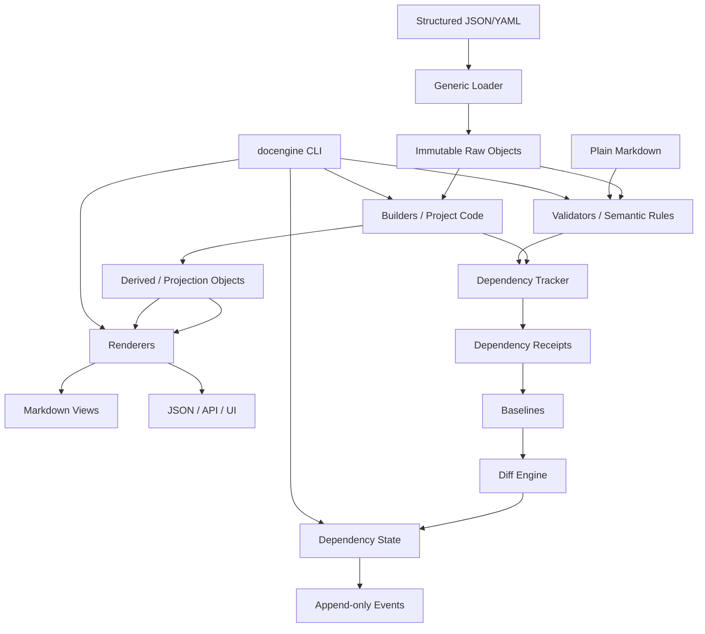

# System Map

## Ownership boundaries

- Documentation content: project `docs/`.
- Structured documentation state: `docs/_structured/`.
- Dependency runtime state: `docs/_dependency/`.
- Project-specific semantics: `docengine_project/`.
- Reusable framework: `src/docengine/` or installed package.

## Implementation status

- **P0 implemented/accepted:** package/CLI entry point, version constants, common JSON envelope, test/contract harness.
- **P1 implemented/accepted:** project config/init, safe root discovery, strict JSON loading, schema adapter, ResourceRef/FieldRef, immutable raw objects, resource catalog/resolver, mirrored `_structured` enforcement, `docengine resources`.
- **P2 implemented/accepted:** project-local builder registry/loading, `BuildContext`, immutable `DerivedObject`, exact tracked reads, derived-of-derived execution and deterministic cycle detection.
- **P3 implemented/accepted:** content-addressed baselines, deterministic receipts, comparators/diffs, reverse graph, dependency state/events, builder-revision invalidation and operational `status/check/diff/explain/history/graph`.
- **P4 implemented/accepted:** project-code semantic rules, review packets, context-token protected `still-valid|updated` validation, actor/reason/evidence trail and semantic review history.
- **P5 implemented/accepted:** renderer registry, managed-view materialization, drift detection, affected/full sync, bounded mixed semantic↔deterministic SCC handling and orphan-safe output policy.
- **P6 implemented/accepted:** complete CLI/AI protocol, schema-2.0.0 machine envelope, stable exit codes, and read-only complete verification.
- **P7 implemented/accepted:** shared/exclusive runtime locking, write-ahead rollback transactions, recovery/migration audit, migration registry, scalability baseline.
- **P8 implemented/accepted:** consolidated global release-gate verification, normalized performance gate, release-manifest tooling, portability checks and final handoff.

- **Repository persistence patch (v0.26):** Git-safe release inventory, tracked repository controls, CI/release workflows and repository maintenance runbook; engine P0–P8 semantics unchanged.

- **Windows repository portability correction (v0.27):** UTF-8-stable self-audit, portable benchmark RSS measurement, platform-correct lock regression, and Windows/Python 3.14 CI; engine P0–P8 semantics unchanged.
