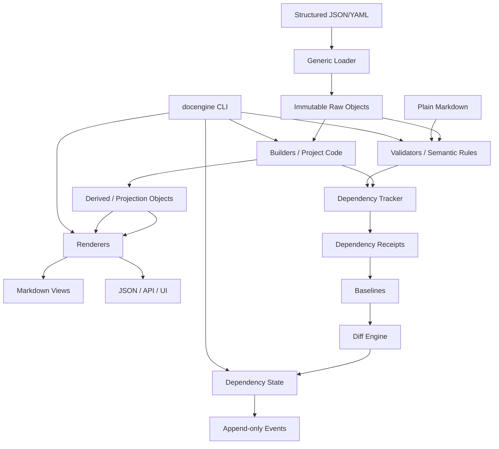

# System Map

## Ownership boundaries

- Documentation content: project `docs/`.
- Structured documentation state: `docs/_structured/`.
- Dependency runtime state: `docs/_dependency/`.
- Project-specific semantics: `docengine_project/`.
- Reusable framework: `src/docengine/` or installed package.

## Implementation status

- **P0 implemented/accepted:** package/CLI entry point, version constants, common JSON envelope, test/contract harness.
- **P1 implemented/accepted:** project config/init, safe root discovery, strict JSON loading, schema adapter, ResourceRef/FieldRef, immutable raw objects, resource catalog/resolver, mirrored `_structured` enforcement, `docengine resources`.
- **P2 implemented/accepted:** project-local builder registry/loading, `BuildContext`, immutable `DerivedObject`, exact tracked reads, derived-of-derived execution and deterministic cycle detection.
- **P3 implemented/accepted:** content-addressed baselines, deterministic receipts, comparators/diffs, reverse graph, dependency state/events, builder-revision invalidation and operational `status/check/diff/explain/history/graph`.
- **P4 implemented/accepted:** project-code semantic rules, review packets, context-token protected `still-valid|updated` validation, actor/reason/evidence trail and semantic review history.
- **P5 implemented/accepted:** renderer registry, managed-view materialization, drift detection, affected/full sync, bounded mixed semantic↔deterministic SCC handling and orphan-safe output policy.
- **P6 implemented/accepted:** complete CLI/AI protocol, schema-2.0.0 machine envelope, stable exit codes, and read-only complete verification.
- **P7 implemented/accepted:** shared/exclusive runtime locking, write-ahead rollback transactions, recovery/migration audit, migration registry, scalability baseline.
- **P8 implemented/accepted:** consolidated global release-gate verification, normalized performance gate, release-manifest tooling, portability checks and final handoff.

- **Repository persistence patch (v0.26):** Git-safe release inventory, tracked repository controls, CI/release workflows and repository maintenance runbook; engine P0–P8 semantics unchanged.

- **Windows repository portability correction (v0.27):** UTF-8-stable self-audit, portable benchmark RSS measurement, platform-correct lock regression, and Windows/Python 3.14 CI; engine P0–P8 semantics unchanged.

- **Git checkout portability correction (v0.28):** canonical-LF manifest freeze guard, fresh-checkout manifest CI gate, and canonical resolved transaction path identity for Windows long/8.3 aliases; P0–P8 semantics unchanged.
- **Documentation/workflow correction (v0.29):** product-first onboarding, normalized atomic use cases (including recover/migrate additive coverage), mirrored project-authoring layout, complete core workflows and executable AI-authoring guidance; runtime semantics unchanged.
- **Independent-review correction (v0.30):** semantic mirrored modules are authoritative, ownership uses `resources` plus `graph` for plain semantic targets, registration proof no longer relies on inventory alone, the semantic tutorial establishes a validated baseline before mutation, onboarding routes are consistent, and future-helper guards are adversarially enforced; runtime semantics unchanged.
- **Clean-chat onboarding correction (v0.31):** zero-context environment/root/trust preflight and task routing added ahead of core workflows; `resources` is explicitly the non-extension-loading initial inventory surface, while extension-loading commands require project-code trust inspection; runtime semantics unchanged.
- **Clean-chat bootstrap finalization (v0.32):** bundled-wheel offline runtime bootstrap is documented and explicit `--project-root` is retained in inspection/full-materialization quickstart examples; runtime semantics unchanged.
- **Explicit-root consistency correction (v0.33):** zero-context project commands retain the selected project root across downstream workflows/examples; project-root vs docs-root semantics and nested initialization are explicit; runtime semantics unchanged.
- **Root-context closure (v0.34):** inline/diagram workflow commands and sample-fixture cwd ordering are corrected, with broader A/B project-root regression coverage; runtime semantics unchanged.
- **Root-guard hardening (v0.35):** regression checks split compound shell commands and detect plain-prose full-form project commands; runtime semantics unchanged.
- **Documentation consistency finalization (v0.36):** current handoff/package identity is synchronized, WF03 restores the baseline addition example, workflow scenario-template requirements are refined additively to a semantic minimum, and the root guard validates `--project-root` as an actual option token; runtime semantics unchanged.
- **Empty-root and WF03 hardening (v0.37):** empty explicit `--project-root` values fail closed instead of resolving to cwd, runtime build advances to `0.1.0.dev21`, WF03 becomes self-contained for fresh A/B/C authoring and final verify, and the zero-context guard validates non-empty root option values across shell operators.
- **Empty-docs-root hardening (v0.38):** explicit empty/whitespace `--docs-root` overrides fail closed consistently in initialization and ordinary commands, closing the split-root/false-verify path; runtime build advances to `0.1.0.dev22`; persisted and machine schemas remain unchanged.
- **Project-config root-policy sync (v0.39):** active project-configuration documentation now states the same non-empty explicit root policy as Quickstart/CLI Contract; runtime remains `0.1.0.dev22`; no runtime/schema change.

- **Field dependency expansion (v0.40):** runtime `0.1.0.dev23` adds explicit `BuildOperation` reuse across CLI evaluation paths, source/code consistency guards and domain handling of derived-source failures. The copyable FieldPlan supports nested JSON Pointers, atomic ownership and object composition; `examples/nested_field_project` demonstrates deadline → estimate → budget. Persisted/machine/layout schemas are unchanged.

- **Transaction lifecycle repair (v0.41):** runtime `0.1.0.dev24` publishes active transactions only after a complete journal and retires committed/rolled-back transactions through an external cleanup ticket. See [Hardening Runtime](HARDENING_RUNTIME.md) and [repair record](../plan/TRANSACTION_LIFECYCLE_FIX.md). Existing field/cache semantics and released evidence schemas remain unchanged.
- **Command snapshots (v0.42):** runtime `0.1.0.dev25` captures used sources once per CLI command and checks source bytes/project Python before completion. Default library checks remain strict; see [Build Runtime](BUILD_RUNTIME.md#command-snapshots-dev25) and [acceptance](../plan/COMMAND_SNAPSHOT_CHECKS.md).
